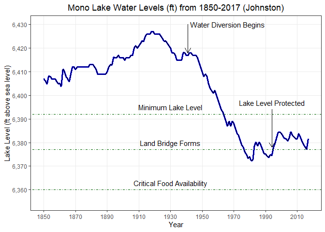
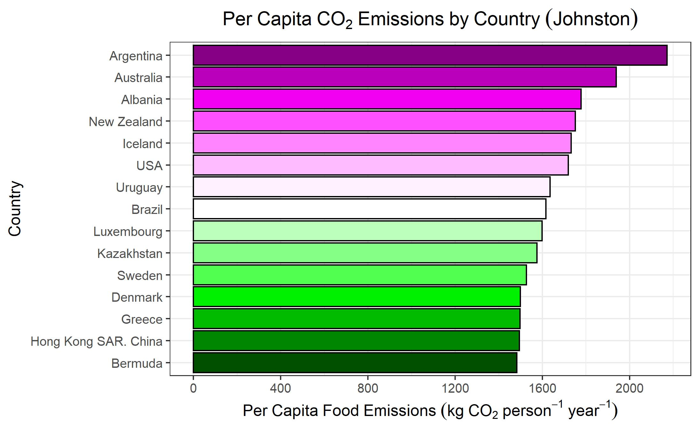
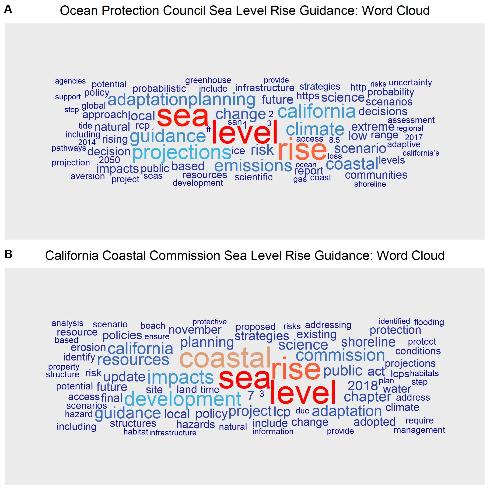
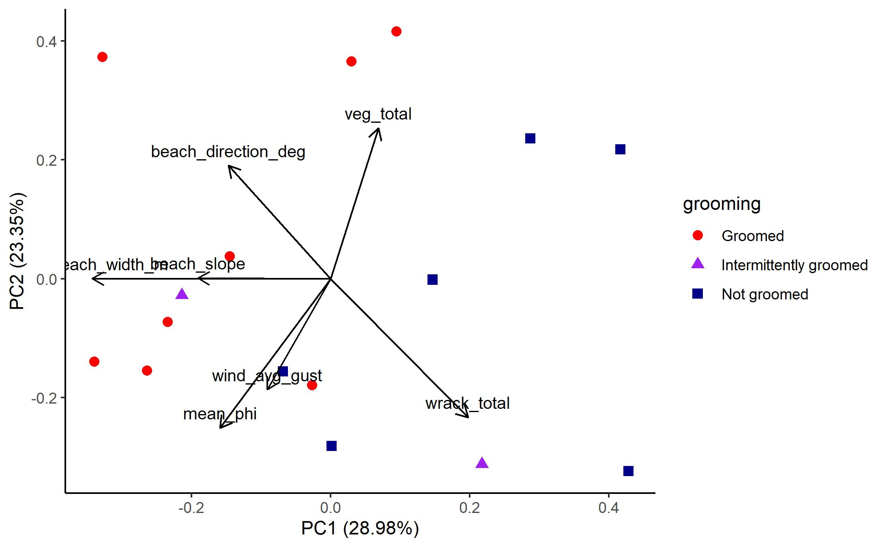

This page includes a variety of static data visualizations that Karina created from various analyses and data sources to showcase the variability of potential data visuals and a range of analyses. Note descriptive captions are below each figure.

Figure 1. Mono Lake water levels in feet above sea level from 1850-2017 (Data: LADWP). Water levels include key environmental and political water limits and notations for major events. In 1941, LA Department of Water and Power began diversions; in 1994, the State Waterboard set a minimum required lake water level.

 

Figure 2. Top 15 countries by total annual per capita carbon dioxide emissions from food consumption (Data: FAO 2018). Food and Agriculture Organization of the United Nations, Food Balance sheets. Data collected on 2018-03-06. Last update of FAO: January 8, 2018. Year of data points: 2013.

 

Figure 3. Word clouds for the Ocean Protection Council (top) and California Coastal Commission (bottom) sea level rise guidance documents (Data: OPC 2018, CCC 2018). This figure compared and contrasted text analysis results from two different California state agency sea level rise guidance documents. Both agencies have science-based approaches to understanding and planning for sea level rise through the implementation of best practices and resilience strategies.

 

Figure 4. Principal Component Analysis (PC 1 and PC2) biplot for beach characterization data of Santa Monica Bay, CA, from 2017-2019 (Data: Dorsey et al. 2021). Variables include physical and biological data across 16 beaches in the Santa Monica Bay. Beaches were categorized by 'grooming', or mechanized raking, of the beaches as a maintenance regime.

