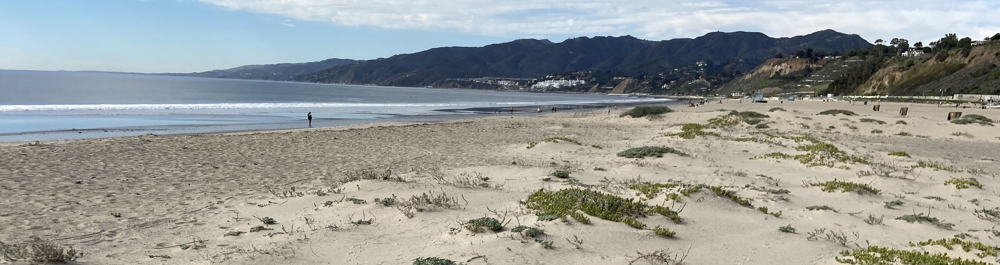

 
Karina Johnston has been a passionate scientific and community restoration ecologist and leader in the southern California region for more than 14 years, with an increasing level of responsibility culminating in her current position with The Bay Foundation as Science Director and her current position with Loyola Marymount University as Director of Programs for the Coastal Research Institute. She is currently directing multiple programs to research and restore coastal habitats and improve coastal resilience. Karina is also a PhD student at the University of California Santa Barbara.

{width=400px}
