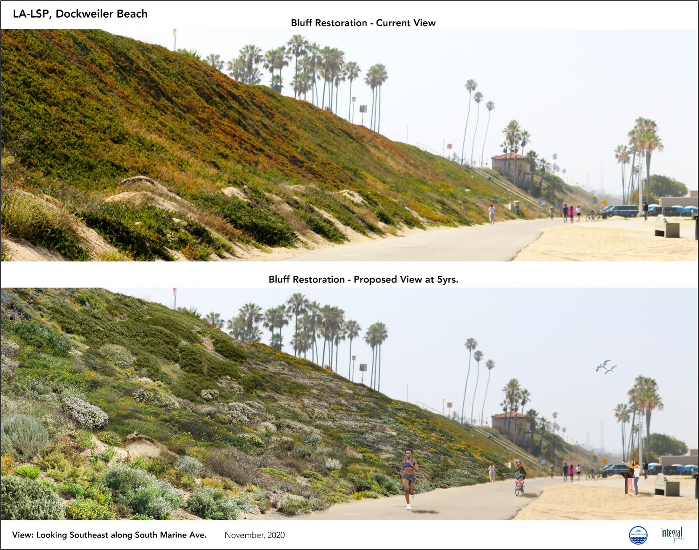

The following selected projects are just a few examples of ecological restoration that Karina has directed, led, or managed as the Science Director for The Bay Foundation (TBF). She has also conducted restoration projects at [Malibu Lagoon](https://www.santamonicabay.org/what-we-do/projects/malibu-lagoon/), [Manhattan Beach](https://www.santamonicabay.org/what-we-do/projects/manhattan-beach-dune-restoration-project/), [Point Dume and Zuma Beach (Malibu)](https://www.santamonicabay.org/what-we-do/projects/malibu-living-shoreline-project/), [LAX Dunes](https://www.santamonicabay.org/what-we-do/projects/lax-dunes/), and other locations. Each project title below is linked to to the project page where you can find more information, additional project photos, and reports and other documents. 

[**Santa Monica Beach Restoration Pilot Project**](https://www.santamonicabay.org/what-we-do/projects/santa-monica-beach-restoration-pilot-project/)

The Bay Foundation restored approximately three acres of beach adjacent to the ocean, by seeding four species of native plants adapted to live in this habitat area. Living on the ocean’s edge, this community of plants grew slowly and attracted insects and birds, while adapting to the harsh conditions of beach life, including salt spray, wind, and intense sunlight. As the plants of the coastal strand habitat grow, they capture windblown sand beneath their leaves. Over time, the plants stabilize the sand and then build small sand dunes that prevent waves and extreme tides from flooding the beach and nearby infrastructure. By reestablishing this habitat, TBF and its partners are able to enhance beaches that are naturally resilient to sea level rise, while creating a refuge for endangered species and adding natural beauty to our beaches. In partnership with her scientific colleagues, Karina designed, found funding, implemented, and scientifically monitored and researched this project as its director. 

{width=300px}

This photograph shows a small dune with native plant species from the middle of the project site facing the ocean (credit: Karina Johnston, The Bay Foundation).

{width=300px}

This photograph shows a series of small dunes with native plant species from the middle of the project site facing approximately north (credit: Karina Johnston, The Bay Foundation).

[**Los Angeles Living Shoreline Project**](https://www.santamonicabay.org/what-we-do/projects/los-angeles-living-shoreline-project/)

The purpose of the Los Angeles Living Shoreline Project is to create an innovative multi-habitat living shoreline at Dockweiler State Beach. The project aims to restore approximately four acres of sandy beach and coastal bluff habitat and implement a pilot restoration to establish an adjacent offshore eelgrass bed. This project is establishing a healthy living shoreline that can support native plants and animal species both in marine and terrestrial ecosystems, while providing enhanced ecosystem services to the community, including benefits to wildlife, carbon sequestration, water quality improvement, nursery habitats, shoreline and sediment stabilization, dune formation, storm protection, and nutrient cycling. In partnership with her scientific colleagues, Karina designed, found funding, implemented, and scientifically monitored and researched this project as its director, with a focus on the beach and dune habitats.  

{width=300px}

This graphic shows a site photograph of the bluff dune before restoration covered in invasive iceplant (top) and an artistic rendering of the site covered in native dune plants approximately five years after restoration actions (bottom) (credit: Integral Consulting).

[**Ballona Wetlands Community Restoration Project**](https://www.santamonicabay.org/what-we-do/projects/ballona-community-iceplant-removal-project/)

The Bay Foundation, in partnership with California Department of Fish and Wildlife, Friends of Ballona Wetlands, and community volunteers, is conducting a project to remove invasive vegetation while broadening public involvement and stewardship at the Ballona Wetlands Ecological Reserve in Los Angeles. The project focuses on the removal of iceplant and other non-native species and then planting native container stock plants and seeding. In partnership with her scientific colleagues, Karina designed, found funding, implemented, and scientifically monitored and researched this project as its director.

{width=300px}

This photograph shows a portion of the community restoration area in the Ballona Wetlands Ecological Reserve with native wetland plants (credit: Karina Johnston, The Bay Foundation). 
